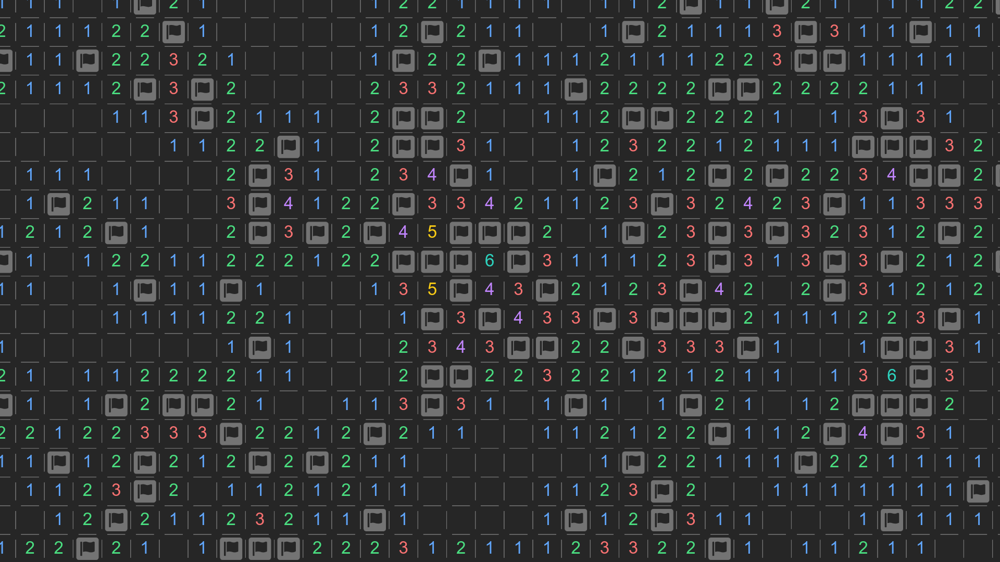

# Infinite Minesweeper

Minesweeper on an infinite board

## Design goals

We want the game to be small, simple and accessible.
So we decided to make it on the web, with no dependencies other than the standard web API.
That means we won't use any:

-   Game engine (like Phaser or Unity)
-   UI framework (like React or Vue)
-   Canvas library (like Pixi.js or P5.js)
-   Preprocessor (like Sass or TypeScript)

Some other things we wanted to keep in mind:

-   📱 Mobile support is built in. So the app must be:

    -   📐 Responsive.
    -   🚀 Fast enough to run on a mobile device.
    -   🕹️ Touch friendly. (support both touch and mouse input)

-   ✨ Decent, presentable graphics, animations and UI.

-   📊 Clean, optimized, well-documented, heavily tested code.

## Instructions

### How to play

Go to [the website](https://infinite-minesweeper.vercel.app) or clone the project and run the HTML file.

### Controls

**Desktop**

-   Click and drag to move
-   Scroll the mouse wheel to zoom

**Mobile**

-   Tap and drag to move
-   Pinch to zoom

**Actions**

-   Left click or tap to reveal a tile
-   Right click to mark a cell as a mine
-   Toggle between reveal and mark with the flag button

Earn points by revealing tiles that don't contain mines.

## Features

| ☑️ Done                    | 🚧 In progress      | 🗒️ Planned        |
| -------------------------- | ------------------- | ----------------- |
| 2D infinite scrolling grid | Animations          | High scores       |
| Randomly placed mines      | SFX                 | Local leaderboard |
| Mobile support             | Menu system         | PWA support       |
|                            | Multiple game modes |                   |

**❓ May or may not be implemented**

-   Online leaderboards/multiplayer
-   Seed based randomization
-   Improve performance with WebGL/WebWorkers/WebAssembly (Rust/C++)
-   Native desktop port with Rust and SDL2

## Made with

-   [HTML/CSS/JS](https://developer.mozilla.org/en-US/docs/Web/)
-   [Canvas](https://developer.mozilla.org/en-US/docs/Web/API/Canvas_API/)
-   [Tailwind CSS colors](https://tailwindcss.com/docs/customizing-colors)
-   [Font Awesome](https://fontawesome.com/v6.0/icons/)
-   [Vercel](https://vercel.com/)

# License

This app is licensed under the [AGPL-3.0 license](LICENSE)
